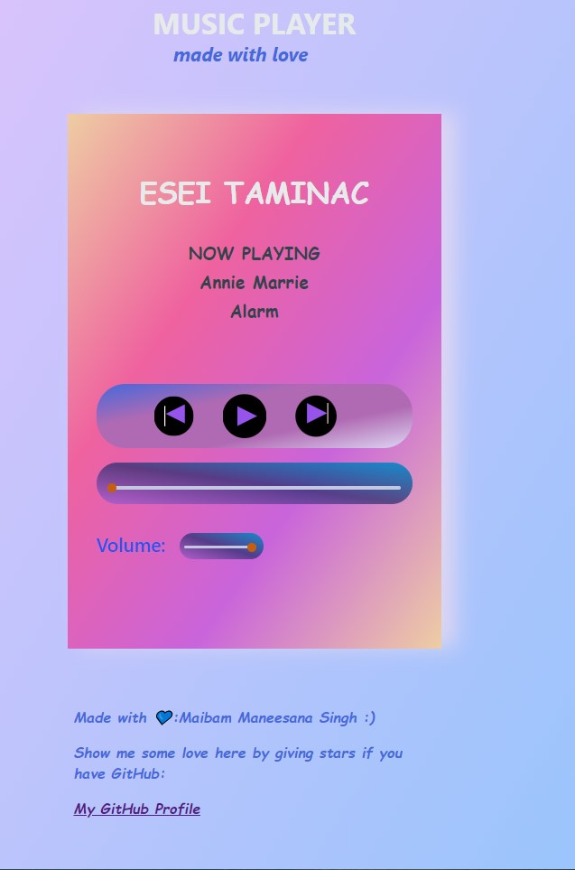

## A Music Player

&emsp;&emsp; **A very simple web based Music Player created by using only HTML CSS and JS**  
&emsp;&emsp;*I already put some songs I downloaded from somewhere here.You can enjoy:)*  
&emsp;&emsp; ***You can play songs from your local machine.Follow the steps given below [-_-]***  
&emsp;&emsp; 

---
**See it for real here:** [LIVE DEMO](http://esei-taminnac-music-player.netlify.app)  
***It will look like this.***  


*** 
## Steps to follow 

1.Make sure you make available your favourite songs offline  and put all of it under the `Music folder`.You can get your songs from some sort of `music-database` using *API* calls    
2.Manually `add` the following code snippet after correctly entering the details for each song you want to listen.  
```js
{
artist:`song-artist-name`,
songname:"song-name",
path:"./Music/{your-song-name}.mp3"
}
```  
3.Make sure you type the correct `path` according to your system  
3. **Now there we go we are done** ***Open the `home.html` file and enjoy***


---
You can find this code in the first part of `home.js` file.
```code
const songCollection = [
  { artist: "Annie Marie", songname: "Alarm", path: "./Music/alarm.mp3" },
  {
    artist: "Alan Walker",
    songname: "Sing Me To Sleep",
    path: "./Music/sing_me_to_sleep.mp3",
  },
  {
    artist: "Alan Walker",
    songname: "On My Way",
    path: "./Music/on_my_way.mp3",
  },
  {
    artist: "Post Malone",
    songname: "You Said ft.6BLACK",
    path: "./Music/you_said.mp3",
  },
  {
    artist: "Tyga King Los",
    songname: "Get Home Freestyle",
    path: "./Music/get_home.mp3",
  },
  {
    artist: "BTS",
    songname: "Savage Love",
    path: "./Music/savage_love.mp3",
  },
  {
    artist: "Rita Ora",
    songname: "Proud",
    path: "./Music/proud.mp3",
  },
  {
    artist: "Alan Walker",
    songname: "Spectre",
    path: "./Music/spectre.mp3",
  },
  {
    artist: "Young Dolph",
    songname: "Key Glock Aspen",
    path: "./Music/aspen.mp3",
  },
  {
    artist: "Jeon Somi",
    songname: "ANYMORE",
    path: "./Music/anymore.mp3",
  },
];
```
